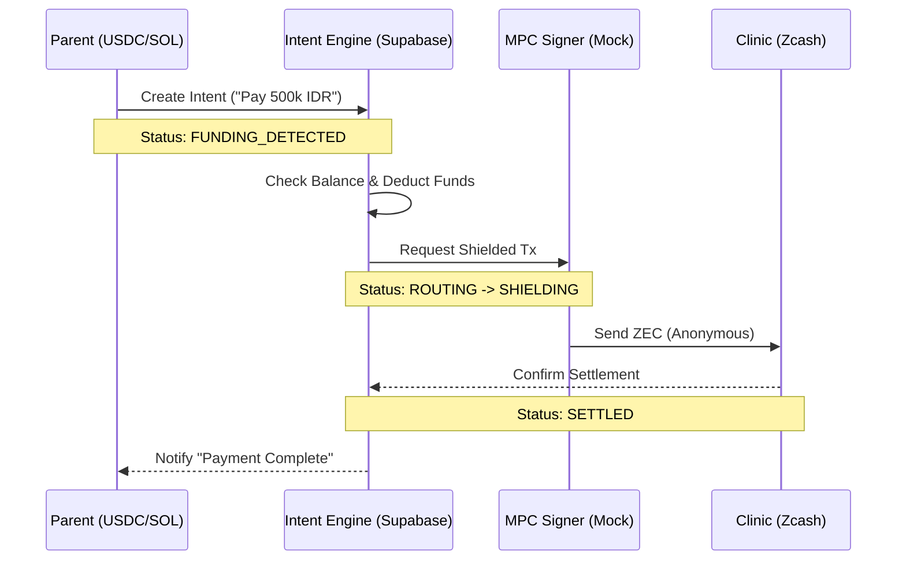

# KiddyGuard: Intent-Based Privacy Rails for Healthcare

> **"Privacy is not about hiding; it's about selective revealing."**

KiddyGuard is a next-generation payment infrastructure that allows parents to pay for sensitive pediatric care using **any asset** (USDC, SOL, Fiat) while the clinic receives **shielded, anonymous funds** (ZEC). 

Built on an **Intent-Based Architecture**, it abstracts away the complexity of bridges, swaps, and cryptography. The user simply expresses an intent—*"Pay Dr. Smith"*—and the protocol handles the routing and privacy preservation in the background.


---

## 🛑 The Problem

In the current financial system, paying for healthcare creates a permanent, public surveillance trail.
* **Banks/Venmo:** Sell transaction data to advertisers and insurers.
* **Public Blockchains (Solana/Ethereum):** Expose your entire wallet history to anyone you transact with.

If a parent pays a specialist for a sensitive condition, that metadata is forever linked to their identity.

## ⚡ The Solution: KiddyGuard Intents

We decouple the **Source of Funds** from the **Settlement of Care**.

1.  **The Intent:** Parent approves a payment in IDR/USDC.
2.  **The Black Box (Solver):** Our engine swaps liquidity and routes it through a Zcash Shielded Pool.
3.  **The Settlement:** The clinic receives a private ZEC transaction with a memo linking it to the medical record, but **zero** link to the parent's wallet.

---

## 🏗 Architecture

We utilize a **"NEAR Intents + Zashi"** mental model:
* **Frontend (Zashi-style):** A clean, declarative UI that hides crypto complexity.
* **Backend (Intent Engine):** A state machine that resolves liquidity and manages the privacy hop.



---

## 🔐 Privacy Guarantees

### What We Protect
- **Source Anonymity:** The clinic cannot trace payments back to parent wallets
- **Transaction Graph Privacy:** No linkability between multiple payments
- **Metadata Isolation:** Medical records are decoupled from payment provenance

### What We Don't Hide
- **Clinic Identity:** Clinics are known entities (required for regulatory compliance)
- **Payment Amount:** Settlement amounts are visible to the clinic (necessary for billing)
- **Medical Record Linkage:** Memos connect payments to records (required for care continuity)

---

## 🚀 Getting Started

### Prerequisites

- Node.js 18+ 
- npm or yarn
- Supabase account and project
- Solana wallet (for development)

### Installation

```bash
# Clone the repository
git clone https://github.com/your-org/kiddyguard.git
cd kiddyguard

# Install dependencies
npm install

# Set up environment variables
cp .env.example .env.local
# Fill in your Supabase and Solana RPC endpoints
```

### Environment Variables

```env
NEXT_PUBLIC_SUPABASE_URL=your_supabase_url
NEXT_PUBLIC_SUPABASE_ANON_KEY=your_supabase_anon_key
SUPABASE_SERVICE_ROLE_KEY=your_service_role_key
SOLANA_RPC_URL=your_solana_rpc_endpoint
```

### Development

```bash
# Run the development server
npm run dev

# Open http://localhost:3000
```

---

## 📊 Intent Lifecycle

Each payment flows through a deterministic state machine:

1. **`PENDING`** - Intent created, awaiting funding
2. **`FUNDING_DETECTED`** - Funds detected in parent wallet
3. **`ROUTING`** - Intent engine determines optimal liquidity path
4. **`SHIELDING`** - Funds routed through Zcash shielded pool
5. **`SETTLED`** - Clinic receives anonymous ZEC payment
6. **`FAILED`** - Error state with failure reason logged

---

## 🧩 Core Components

### Intent Engine (`src/lib/intents/IntentSolver.ts`)
The state machine that orchestrates the privacy-preserving payment flow. Handles balance checks, liquidity routing, and settlement confirmation.

### Parent Dashboard (`src/components/dashboard/ParentDashboard.tsx`)
Clean, declarative UI for parents to:
- View child medical records
- Approve payment intents
- Monitor transaction status

### Clinic Interface (`src/app/clinic/page.tsx`)
Clinic-facing dashboard for:
- Receiving anonymous payments
- Linking payments to medical records
- Viewing settlement history

---

## 🔬 Technical Stack

- **Frontend:** Next.js 14, React, TypeScript, TailwindCSS
- **Backend:** Supabase (PostgreSQL + RLS + Edge Functions)
- **Blockchain:** Solana (USDC/SOL), Zcash (ZEC)
- **State Management:** Zustand
- **UI Components:** shadcn/ui

---

## 🛡️ Security & Privacy

- **Row-Level Security (RLS):** Database-level access control
- **Intent-Based Architecture:** Users never interact with raw crypto primitives
- **Shielded Pool Routing:** All clinic settlements go through Zcash privacy pools
- **MPC Signing:** (Mock implementation) Future upgrade to multi-party computation for key management

---

## 📈 Roadmap

### Phase 1: MVP ✅
- [x] Intent creation and state management
- [x] Multi-asset wallet support (USDC, SOL, Fiat)
- [x] Zcash settlement integration
- [x] Parent and clinic dashboards

### Phase 2: Production Hardening
- [ ] Real MPC signing infrastructure
- [ ] Liquidity pool integration
- [ ] Multi-chain bridge support
- [ ] Regulatory compliance tooling

### Phase 3: Protocol Expansion
- [ ] Intent marketplace for solvers
- [ ] Cross-chain privacy rails
- [ ] Healthcare-specific compliance modules

---

## 🤝 Contributing

We welcome contributions! Please see our [Contributing Guide](CONTRIBUTING.md) for details.

---

## 📄 License

This project is licensed under the MIT License - see the [LICENSE](LICENSE) file for details.

---

## 🙏 Acknowledgments

- Inspired by NEAR Protocol's Intent Architecture
- UI patterns influenced by Zashi's declarative approach
- Privacy guarantees built on Zcash's shielded pool technology

---

## 📮 Contact

For questions, partnerships, or investment inquiries:
- **Email:** contact@kiddyguard.io
- **Website:** https://kiddyguard.io
- **Twitter:** [@KiddyGuard](https://twitter.com/kiddyguard)

---

**Built with ❤️ for privacy-preserving healthcare payments**
